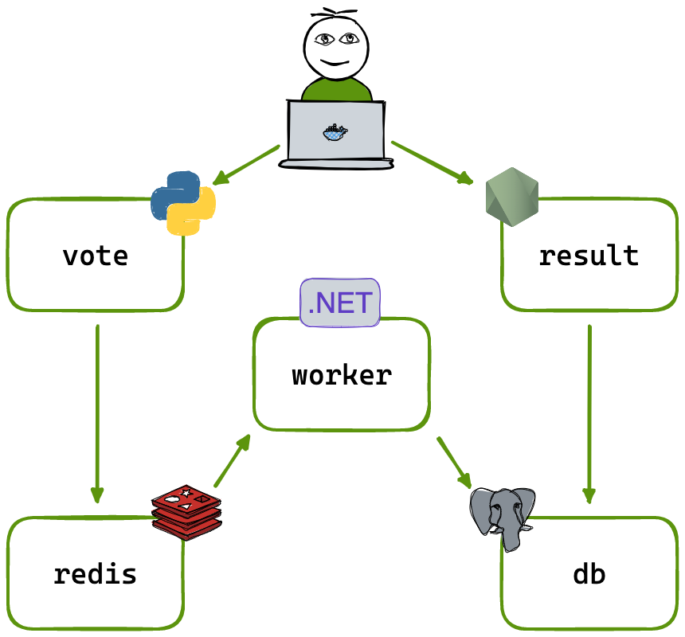

# Voting App CI/CD with Azure DevOps, AKS, ACR and Argo CD

## Project Overview

This project is based on the Docker Example Voting App. The original application contains multiple microservices built with Python, Node.js, .NET, Redis and PostgreSQL.

I used the Docker sample application as the base project and implemented a complete end-to-end DevOps workflow using Azure cloud services, Kubernetes and GitOps.

The project demonstrates how a microservices application can be containerized, built through CI pipelines, pushed to Azure Container Registry, deployed to Azure Kubernetes Service, and continuously synced using Argo CD.

---

## What I Implemented

- Imported the Docker sample voting application into Azure Repos
- Created Docker-based CI pipelines for the main custom microservices
- Built and pushed Docker images to Azure Container Registry
- Created Kubernetes manifests for deployments and services
- Deployed the application to Azure Kubernetes Service
- Configured image pull secrets for pulling private ACR images
- Created Azure DevOps CI/CD pipelines for:
  - vote
  - result
  - worker
- Created an update script to automatically update Kubernetes deployment image tags with the Azure DevOps Build ID
- Integrated Argo CD with Azure Repos for GitOps-based continuous deployment
- Verified application deployment through Kubernetes pods, services and UI access

---

## Architecture



The application contains the following components:

| Component | Technology | Purpose |
|---|---|---|
| vote | Python / Flask | Frontend where users submit votes |
| redis | Redis | Stores incoming votes temporarily |
| worker | .NET | Reads votes from Redis and writes them to PostgreSQL |
| db | PostgreSQL | Stores voting results |
| result | Node.js | Displays voting results in real time |

---

## Repository Structure

```text
voting-app/
│
├── vote/
│   ├── Dockerfile
│   └── application source code
│
├── result/
│   ├── Dockerfile
│   └── application source code
│
├── worker/
│   ├── Dockerfile
│   └── application source code
│
├── k8s-specifications/
│   ├── vote-deployment.yaml
│   ├── vote-service.yaml
│   ├── result-deployment.yaml
│   ├── result-service.yaml
│   ├── worker-deployment.yaml
│   ├── redis-deployment.yaml
│   ├── redis-service.yaml
│   ├── db-deployment.yaml
│   └── db-service.yaml
│
├── Pipelines/
│   ├── vote-ci-cd.yml
│   ├── result-ci-cd.yml
│   └── worker-ci-cd.yml
│
├── Scripts/
│   └── Updatek8Manifests.sh
│
├── architecture.excalidraw.png
│
├── docker-compose.yml
├── docker-compose.images.yml
├── docker-stack.yml
├── .gitattributes
├── .gitignore
├── LICENSE
└── README.md


The final workflow supports:

Automated Docker image build
Image push to Azure Container Registry
Kubernetes manifest update with Build ID
Git commit back to Azure Repos
Argo CD GitOps-based deployment to AKS

This project shows how application code, Docker, CI/CD pipelines, Kubernetes manifests, and GitOps work together in an end-to-end cloud-native deployment workflow.
